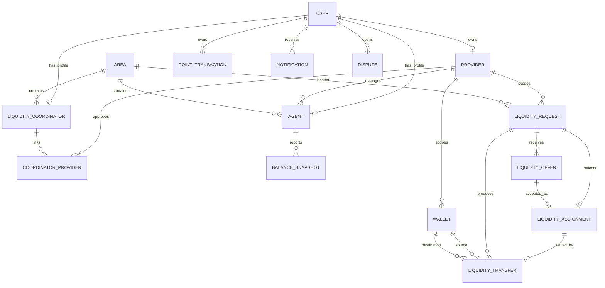

# LiquidityOS Project Requirement Sheet

## Project title

**LiquidityOS: A SaaS Application for Smart Liquidity Management in Mobile Financial Service Agent Networks**

## Problem statement

Mobile Financial Service agents need both physical cash and electronic money to serve customers. An agent may have enough e-money but insufficient physical cash for a withdrawal, or enough physical cash but insufficient e-money for a deposit.

Agents currently depend on phone calls, manual coordination, and informal relationships to find liquidity. This causes delayed or failed customer transactions even when another participant nearby has sufficient liquidity.

LiquidityOS provides a central REST API where:

- Agents report and request liquidity shortages.
- Providers manage agents, coordinators, areas, and wallets.
- Coordinators submit liquidity offers.
- Wallet balances are transferred atomically.
- Points reward liquidity activity.
- Notifications inform users.
- Disputes record and resolve problems.
- Administrators govern the platform.

## Technology stack

| Layer | Technology |
|---|---|
| Framework | NestJS |
| Language | TypeScript |
| Database | PostgreSQL |
| ORM | TypeORM |
| Authentication | Passport JWT |
| Password security | bcrypt |
| Validation | class-validator and class-transformer |
| API documentation | Swagger/OpenAPI |
| Configuration | `@nestjs/config` and `.env` |
| Testing | Jest and Supertest |
| API client | Postman |

## System roles

LiquidityOS has four roles:

1. **Admin**
2. **Provider**
3. **Coordinator**
4. **Agent**

Authentication answers:

> Who is making the request?

Authorization answers:

> Is this authenticated user allowed to perform this action?

## Role-based functionalities

### Admin

- List and manage users.
- Create and manage service areas.
- Create, approve, reject, and delete providers.
- Onboard and manage agents.
- Onboard and manage coordinators.
- Create and freeze wallets.
- View platform data.
- Create notifications.
- View and resolve disputes.
- Delete zero-balance wallets.

### Provider

- Onboard and update agents.
- Approve or reject coordinator relationships.
- View provider agents and coordinators.
- View liquidity shortages.
- View provider dashboard statistics.
- Create and freeze wallets.
- Supply liquidity from provider wallets to coordinator wallets.
- Create liquidity requests.
- Execute permitted transfers.

### Coordinator

- View areas, wallets, and permitted requests.
- Create liquidity requests.
- Submit, update, withdraw, and delete liquidity offers.
- Execute permitted wallet transfers.
- View and redeem points.
- View notifications.
- Open disputes.

### Agent

- Authenticate and manage their own profile.
- Report balance snapshots.
- View areas and permitted wallets.
- Create and manage liquidity requests.
- Execute permitted transfers.
- View and redeem points.
- View notifications.
- Open disputes.

## Module-based architecture

```text
AppModule
├── AuthModule
├── UsersModule
├── ProvidersModule
├── AreasModule
├── AgentsModule
├── CoordinatorsModule
├── WalletsModule
├── BalanceSnapshotsModule
├── LiquidityRequestsModule
├── LiquidityOffersModule
├── LiquidityTransfersModule
├── PointsModule
├── NotificationsModule
├── DisputesModule
├── MailerModule
└── AuditLogsModule
```

Each feature normally contains:

```text
Controller -> HTTP routes
Service    -> business and database logic
DTO        -> request structure and validation
Entity     -> PostgreSQL table structure
Module     -> dependency wiring
```

## Database design

The project currently creates 15 application tables.

### 1. users

| Column | Purpose |
|---|---|
| `id` | UUID primary key |
| `name` | User display name |
| `email` | Unique login email |
| `phone` | Optional unique phone |
| `providerId` | Provider association |
| `password` | bcrypt password hash |
| `role` | Admin, provider, coordinator, or agent |
| `status` | Account status |
| `createdAt` | Creation timestamp |
| `updatedAt` | Update timestamp |

### 2. providers

Stores MFS provider organizations, tenant codes, owners, contact information, onboarding status, and notes.

### 3. areas

| Column | Purpose |
|---|---|
| `id` | UUID primary key |
| `name` | Geographic area name |
| `code` | Unique area code |
| `status` | Active or inactive |
| `createdAt` | Creation timestamp |
| `updatedAt` | Update timestamp |

### 4. agents

Stores the user, provider, area, shop name, address, and account status for an MFS agent.

### 5. liquidity_coordinators

Stores coordinator profiles and their user/area information.

### 6. coordinator_providers

Connects coordinators to providers and stores approval or rejection state.

### 7. wallets

| Column | Purpose |
|---|---|
| `id` | UUID primary key |
| `ownerId` | Owner identifier |
| `ownerType` | Agent, coordinator, or provider |
| `providerId` | Provider scope |
| `walletType` | Physical cash or e-money |
| `balance` | PostgreSQL bigint balance |
| `status` | Active or frozen |
| `createdAt` | Creation timestamp |
| `updatedAt` | Update timestamp |

### 8. balance_snapshots

Stores an agent's reported cash and e-money balance at a particular time.

### 9. liquidity_requests

Stores the requester, provider, area, liquidity type, requested amount, urgency, partial-fill setting, status, notes, and expiration.

### 10. liquidity_offers

Stores coordinator offers against liquidity requests, including available amount, ETA, note, and status.

### 11. liquidity_transfers

Stores wallet-to-wallet transfers, request/assignment references, amount, transfer type, idempotency key, status, and completion time.

### 12. liquidity_assignments

Stores the single accepted offer for a request, the assigned coordinator user, the authorizing user, locked amount, and assignment lifecycle status.

### 13. point_transactions

Stores earned, reversed, and redeemed point-ledger entries.

### 14. notifications

Stores in-application notifications, JSON payloads, read status, and timestamps.

### 15. disputes

Stores disputes related to a request or transfer, the opening user, reason, resolution state, and resolution note.

## Logical ER diagram

The current implementation primarily stores relationships using UUID columns. Some relationships are logical and have not yet been implemented as TypeORM foreign-key decorators.



## Important REST API groups

All endpoints use:

```text
http://localhost:3000/api/v1
```

### Authentication and profile

```text
POST  /auth/register
POST  /auth/login
GET   /auth/me
GET   /users/me
PATCH /users/me
PATCH /users/me/password
```

### User management

```text
GET    /users
GET    /users/:id
PATCH  /users/:id
DELETE /users/:id
```

ID-based user management is restricted to administrators.

### Providers

```text
POST   /providers
GET    /providers
GET    /providers/:id
PATCH  /providers/:id
DELETE /providers/:id
POST   /providers/:id/approve
POST   /providers/:id/reject
GET    /providers/:id/agents
GET    /providers/:id/coordinators
POST   /providers/:id/coordinators/:coordinatorId/approve
POST   /providers/:id/coordinators/:coordinatorId/reject
GET    /providers/:id/shortages
GET    /providers/:id/dashboard
POST   /providers/:id/wallets/supply
```

### Areas

```text
POST   /areas
GET    /areas
GET    /areas/:id
PATCH  /areas/:id
DELETE /areas/:id
```

### Agents

```text
POST   /agents/onboard
GET    /agents
GET    /agents/:id
PATCH  /agents/:id
DELETE /agents/:id
```

### Coordinators

```text
POST   /coordinators/onboard
GET    /coordinators
GET    /coordinators/:id
PATCH  /coordinators/:id
DELETE /coordinators/:id
```

### Wallets

```text
POST   /wallets
GET    /wallets
GET    /wallets/:id
PATCH  /wallets/:id
DELETE /wallets/:id
```

### Balance snapshots

```text
POST   /balance-snapshots
GET    /balance-snapshots
GET    /balance-snapshots/:id
PATCH  /balance-snapshots/:id
DELETE /balance-snapshots/:id
```

### Liquidity requests

```text
POST   /liquidity-requests
GET    /liquidity-requests
GET    /liquidity-requests/:id
PATCH  /liquidity-requests/:id
POST   /liquidity-requests/:id/cancel
DELETE /liquidity-requests/:id
```

### Liquidity offers

```text
POST   /liquidity-offers
GET    /liquidity-offers
GET    /liquidity-offers/:id
PATCH  /liquidity-offers/:id
POST   /liquidity-offers/:id/withdraw
POST   /liquidity-offers/:id/accept
DELETE /liquidity-offers/:id
```

### Liquidity transfers

```text
POST /liquidity-transfers
GET  /liquidity-transfers
GET  /liquidity-transfers/:id
```

Transfer creation requires:

```text
Idempotency-Key: a-unique-client-generated-value
```

### Points

```text
GET  /points/balance
GET  /points/transactions
POST /points/redeem
```

### Notifications

```text
POST  /notifications
GET   /notifications
PATCH /notifications/:id/read
POST  /notifications/read-all
```

### Disputes

```text
POST /disputes
GET  /disputes
GET  /disputes/:id
POST /disputes/:id/resolve
```

## Minimum-requirement evaluation

| Requirement | Status | Project evidence |
|---|---|---|
| At least four database entities | Complete | 15 application entities |
| At least three roles | Complete | Admin, provider, coordinator, agent |
| Role-based functionalities | Complete foundation | `@Roles()` used across controllers |
| JWT authentication | Complete | AuthModule, JwtService, JwtStrategy, JwtAuthGuard |
| Role-based authorization | Complete foundation | Roles decorator and RolesGuard |
| Database integration | Complete | PostgreSQL, TypeORM repositories |
| Complete CRUD APIs | Mostly complete | CRUD exists for users, providers, areas, agents, coordinators, wallets, requests, offers, and snapshots |
| DTO request validation | Complete foundation | DTO classes and ValidationPipe |
| Module-based structure | Complete | Feature modules for each domain |
| Secure password hashing | Complete | bcrypt hash and compare |
| Input validation | Complete foundation | class-validator decorators |
| RESTful naming | Complete foundation | Resource-oriented URLs and HTTP methods |

## Bonus-requirement evaluation

| Bonus | Status | Evidence or gap |
|---|---|---|
| Email notifications | Not implemented | MailerModule exists but service is empty |
| Refresh tokens | Not implemented | Only access tokens exist |
| Custom decorators | Implemented | `@Roles()` |
| Global exception handling | Partial | NestJS exceptions used; no custom global filter |
| Search/filter/sort/pagination | Implemented | Provider, area, and agent listing support |
| File upload | Not implemented | No multipart upload module |
| Swagger | Implemented | `/api/docs` and `/api/docs-json` |
| NestJS Logger | Basic only | Framework logs; no application logging strategy |
| Caching | Not implemented | No Redis or CacheManager |
| Soft delete/restore | Not implemented | Current delete operations are hard deletes |
| Audit logs | Not implemented | Module exists but service/entity behavior is absent |
| Database transactions | Implemented | Registration and wallet transfers |
| `.env` configuration | Implemented | Database and JWT values |
| Migrations | Not implemented | Current schema uses `synchronize: true` |
| Fine-grained permissions | Partial | Roles exist; ownership/tenant checks remain incomplete in several modules |

## Whole-project demonstration sequence

The following sequence presents LiquidityOS as a business system rather than only an authentication system.

### Part 1: Security foundation

1. Register an agent.
2. Login and receive JWT.
3. Access `/users/me`.
4. Demonstrate `401` without JWT.
5. Demonstrate `403` when an agent calls `/users`.

### Part 2: Network setup

6. Admin creates an Area.
7. Admin creates or approves a Provider.
8. Provider/Admin onboards an Agent in the Area.
9. Admin onboards a Coordinator.
10. Provider approves the coordinator relationship.

### Part 3: Wallet setup

11. Provider creates physical-cash and e-money wallets.
12. Agent reports a balance snapshot.
13. Provider views wallets and agent information.

### Part 4: Liquidity coordination

14. Agent creates a liquidity request.
15. Coordinator views the request.
16. Coordinator submits a liquidity offer.
17. Request owner/provider/admin accepts the offer and creates an assignment.
18. Authorized actor executes the assigned transfer with an idempotency key.

### Part 5: Supporting functionality

19. User views points and point transactions.
20. User views and marks notifications as read.
21. User opens a dispute.
22. Admin views and resolves the dispute.
23. Provider opens the dashboard and shortage list.

## Known gaps that must be stated honestly

The API contains many working feature endpoints, but the complete automated business lifecycle still has gaps:

- General tenant and resource-ownership checks are incomplete.
- Transfer reversal is missing.
- Points are not automatically awarded after every transfer.
- Notifications are not automatically triggered from every business event.
- Mailer and audit-log behavior are not implemented.
- Foreign-key relationships are mostly represented by UUID values rather than enforced TypeORM relations.
- Automated test coverage is very limited.

These gaps do not remove the implemented minimum-requirement foundation, but they should not be presented as completed bonus features.

## Faculty presentation summary

> LiquidityOS is a modular NestJS and PostgreSQL API for coordinating physical cash and electronic money across mobile financial service networks. It supports four user roles, JWT authentication, role-based authorization, validated DTOs, TypeORM database CRUD, wallet transactions, liquidity requests and offers, points, notifications, disputes, filtering, Swagger documentation, and environment-based configuration.
>
> The demonstration begins with authentication, then creates the operational network, creates wallets, reports balances, opens a liquidity request, submits an offer, executes a protected transfer, and demonstrates supporting points, notification, dispute, and dashboard APIs.
